# How to play Mudcrown

*From park pitch to top flight.* Mudcrown is a short, simple football manager. You take over a park
club in a local league at the bottom of a country's football, eight levels below the top, and
climb. This guide walks through the game screen by screen, with tips at the end of each part and
a page of tips and tricks at the end.

The game teaches itself too: the Desk offers a **tutorial** in your first season, a tour of your
club page by page, and **How to play** and **FAQ** on the title screen have the same lessons and the
common questions. This guide is the long version.

Play at [mudcrown.com](https://mudcrown.com), in a phone's or a computer's browser.

**Contents**

1. [Starting a career](#1-starting-a-career)
2. [The Desk](#2-the-desk)
3. [The days and your post](#3-the-days-and-your-post)
4. [Match day](#4-match-day)
5. [Your squad](#5-your-squad)
6. [Tactics](#6-tactics)
7. [Training, youth and the medical room](#7-training-youth-and-the-medical-room)
8. [The league, the cups and the summer](#8-the-league-the-cups-and-the-summer)
9. [The market](#9-the-market)
10. [Contracts](#10-contracts)
11. [The money](#11-the-money)
12. [The ground](#12-the-ground)
13. [The owner, the fans and your job](#13-the-owner-the-fans-and-your-job)
14. [The end of a season](#14-the-end-of-a-season)
15. [Signing in and playing on more than one device](#15-signing-in-and-playing-on-more-than-one-device)
16. [Tips and tricks](#16-tips-and-tricks)

---

## 1. Starting a career

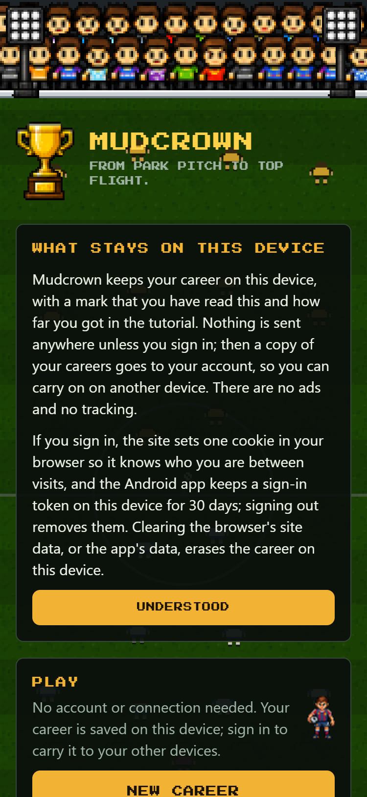

On the title screen, press **New career**. No account is needed: the career is saved on the device
you play on, as you play. Only one career is kept on a device; **Continue** carries it on and
**Delete** removes it (the game asks once more).

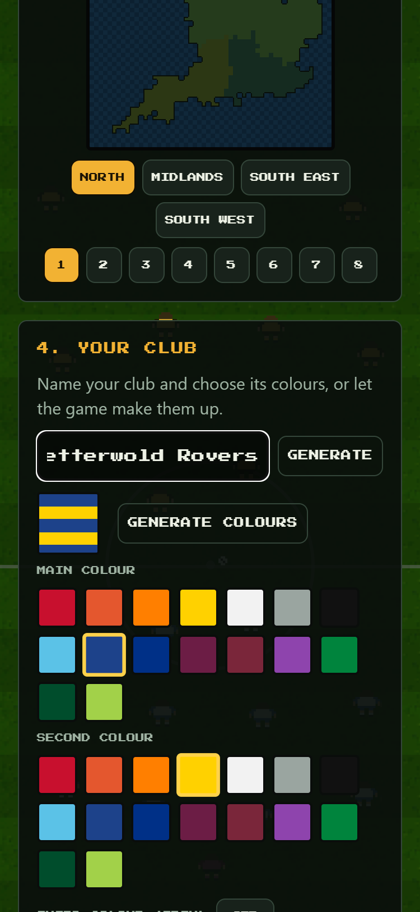

The New career page fills in from the top:

1. **Your name and face.** Type a name or press **Generate**, and pick a face with the arrows.
   Names with bad words, or the names of real footballers, managers and clubs, are not accepted;
   the game says why as you type.
2. **Country.** One of eight: England, Spain, Italy, Germany, France, the Netherlands, Portugal or
   Poland. Each has its own towns, names and leagues.
3. **Where you start.** Tap a region on the map, then one of its eight numbered local areas. Your
   club starts in that area's league, at level 8.
4. **Your club.** A name and the colours: a main colour, a second colour, a pattern and, if you
   like, a third colour for the trim. **Generate** suggests either.

Press **Start career**.

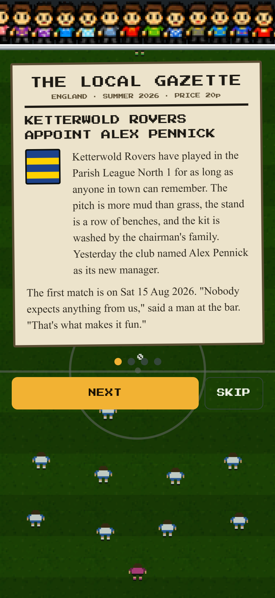

The local paper, the owner and the fans have their say before you take over. **Next** reads on,
**Skip** goes straight to the club.

> **Tip.** Every club is invented, and so is every player, town and competition; only the
> countries are real. Your choice of area matters only for who your neighbours are: every area's
> bottom league is as hard as any other.

## 2. The Desk

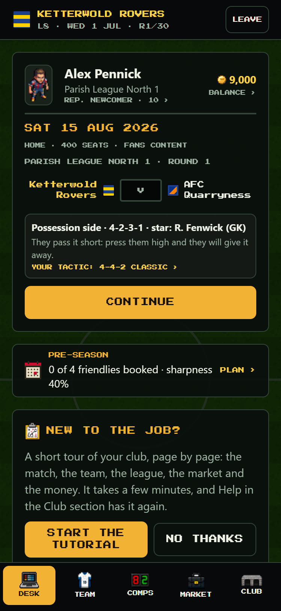

The Desk is your office and the career's home. From the top:

- **The scoreboard**: your club, its level (L8), today's date and the round. **Leave** goes back to
  the title screen; the career is saved all the time.
- **You**: your name, your league, your reputation (tap it for the Manager page) and the bank
  **balance** (tap it for Finances).
- **The next match**: the date, home or away, the ground's size, the fans' mood, the competition,
  the two clubs, and a report on the opponent: how they play, their shape, their best player and a
  hint on how to beat them. **Your tactic** opens Tactics.
- **Continue**, the key that moves the game on (next part).
- **Cards** for what needs you now: friendlies to book in July, sponsors before the first match,
  the ground's rules after a promotion.
- **The tabs** at the bottom are the club's five rooms: **Desk**, **Team** (squad, tactics,
  training, youth, medical), **Comps** (league, fixtures, stats, cups, pre-season, seasons),
  **Market** (transfers, scouting, contracts) and **Club** (news, finances, ground, shop, staff,
  fans, manager, owner, press, help).

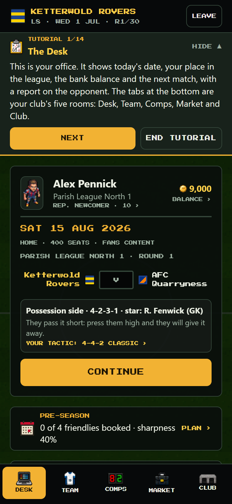

In your first season the Desk offers **Start the tutorial**. A bar under the scoreboard explains one
page at a time; **Next** takes you to the next page, **Hide** folds the bar away so you can try the
page, **End tutorial** stops it. **Help** in the Club tab starts it again whenever you like.

## 3. The days and your post

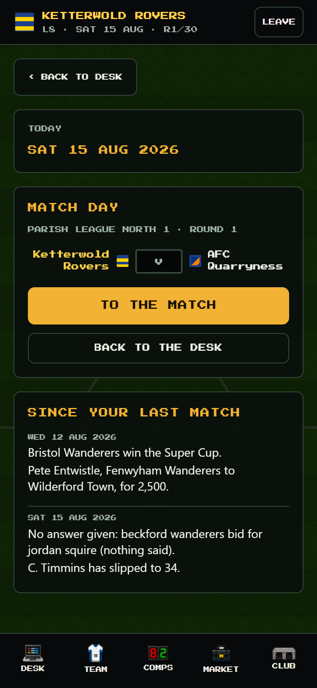

**Continue** does not jump to the match: it runs the calendar on, a day at a time, to your next match
day (league, cup or friendly). As the days pass you see the other results, the Monday money, the
post, transfers, injuries and training. **Skip to the end** shows the rest of the days at once. On
match day: **To the match**.

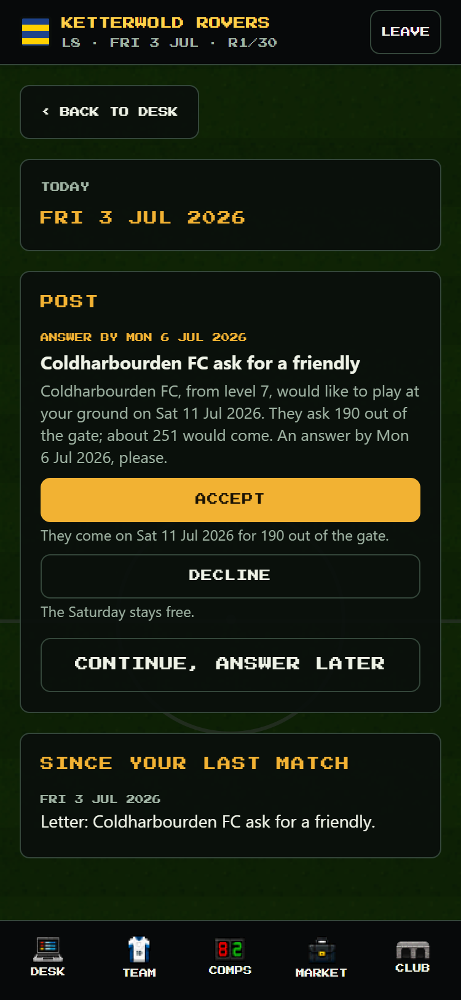

A letter that needs an answer stops the days. Answer it there, or press **Continue, answer later**.
Letters come from:

- **Other clubs**: bids for your players, loan offers, invitations to friendlies, and job offers for
  you.
- **Your players**: one unhappy with his playing time, one whose contract ends, one who wants to
  leave, a boy turning 19 in the youth team.
- **Your staff**: scout reports, the youth intake, the week's training.
- **The owner, the fans and the press.**

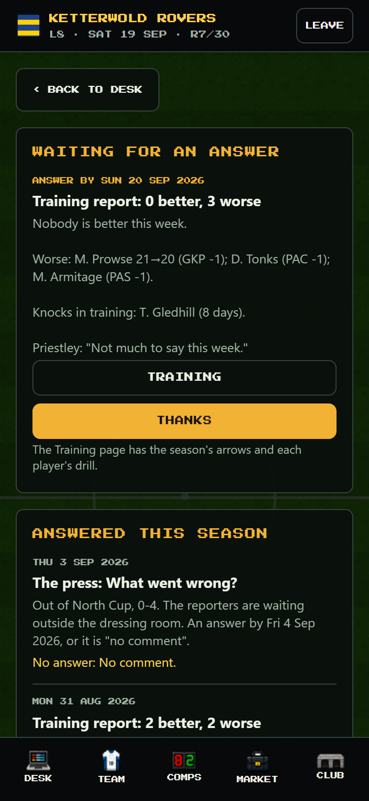

The red number on the Desk's **Post** counts the letters waiting for you; **News** counts the news
you have not read.

> **Tip.** A letter left unanswered takes its default answer when its time is up: a friendly is
> declined, a bid turned down, a player's request refused. If you want something else, answer in
> time.

## 4. Match day

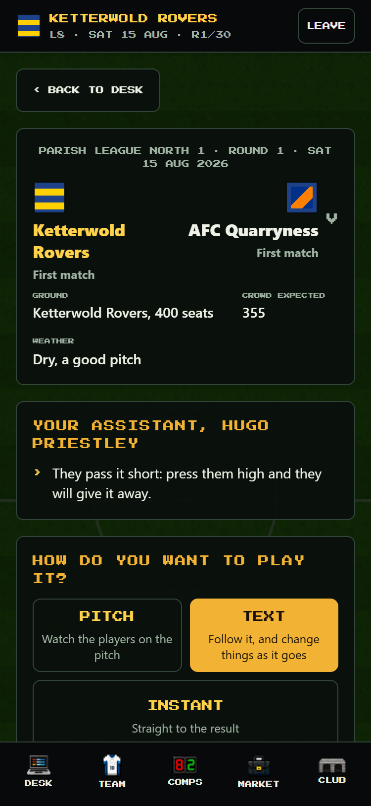

Before kick-off you see the ground, the crowd expected, the weather, the opponent and your team, with
keys to **Tactics** and **Squad** for a last change. Then choose how to see it:

- **Pitch**: watch the players on the pitch.
- **Text**: follow the commentary, and change things as it goes.
- **Instant**: straight to the result.

**Game plan** on lets your plan (set on the Tactics page) change the tactic and make the
substitutions for you; any change of your own turns it off. **Next time, go straight to the result**
skips this page.

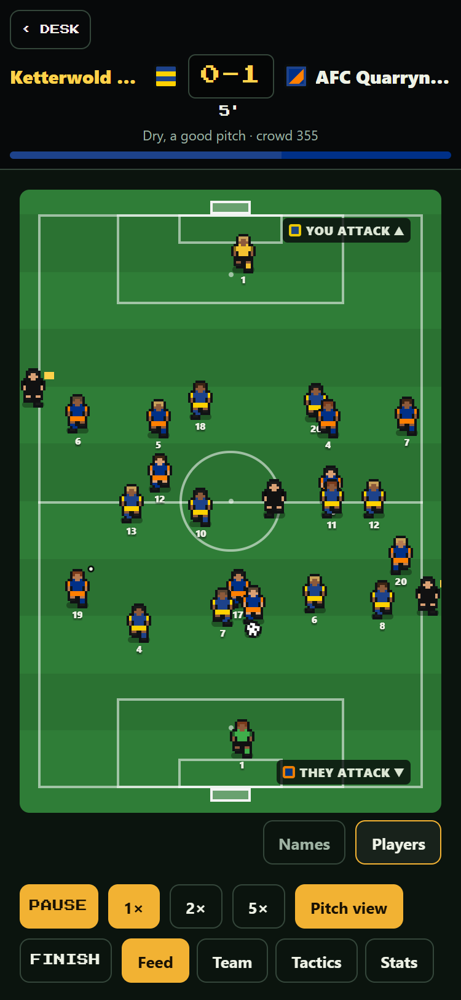

In the match the clock runs a minute every two seconds; the speed keys go faster, **Pause** stops it.
The tabs under the pitch:

- **Feed**: what happens.
- **Team**: your players, their condition and their marks; make substitutions here. Up to five
  substitutes in at most three stops (half-time does not count).
- **Tactics**: switch to tactic A, B or C, change the five instructions, move players.
- **Stats**: shots, shots on target, the ball, fouls and saves.

The match stops by itself at half-time, for an injury to one of yours and for a red card.

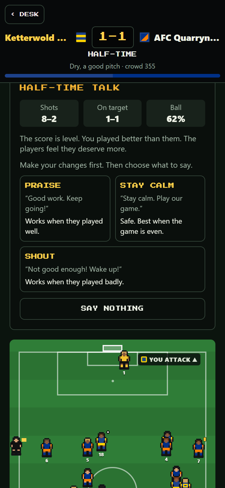

At **half-time** you see the first half in numbers (shots, on target, the ball) and in a few words,
make your changes, then talk to the team: **Praise** works when they played well, **Stay calm** is
safe and best when the game is even, **Shout** works when they played badly; or **Say nothing**.

A level cup tie goes to extra time and then penalties, taken kick by kick.

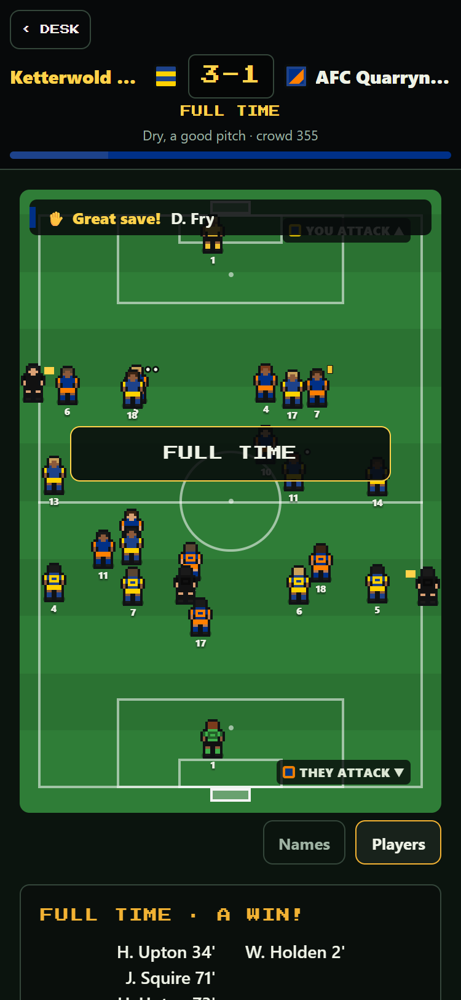

At full time: the result, the scorers and the marks, **Watch the goals again**, and **Continue**
back to the Desk. Leave a match half-way and the Desk offers to **Resume the match**.

> **Tip.** The weather counts: mud and wind spoil a short-passing game and help a direct one.

## 5. Your squad

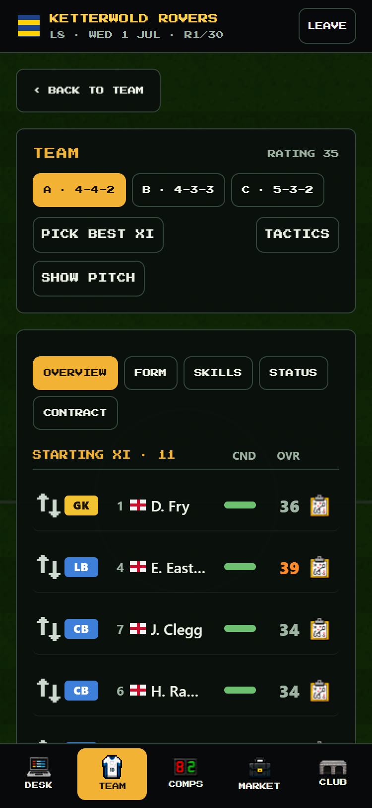

Team, **Squad**: the starting eleven, the bench of seven and the reserves. The tactic chips (A, B, C)
choose the shape; **Pick best XI** picks the eleven for you; **Show pitch** draws the team on a pitch.
The tabs over the list show each player's overview, form, skills, status and contract.

- **To swap two players**, drag one by his handle onto the other, in the list or on the pitch, or
  tap one handle and then the other.
- **The key at the end of a row** moves a player to the eleven, the bench or the reserves, and gives
  him the armband, the penalties or the free kicks.
- **Every player has a position chip** in his line's colour: GK, LB, CB, RB, LM, CM, RM, LW, ST,
  RW. **Orange** means he plays out of position in that slot, and his rating there drops by about
  an eighth (a little on the wrong side).
- **Tap a column's head** to sort; the legend under the table explains each column.

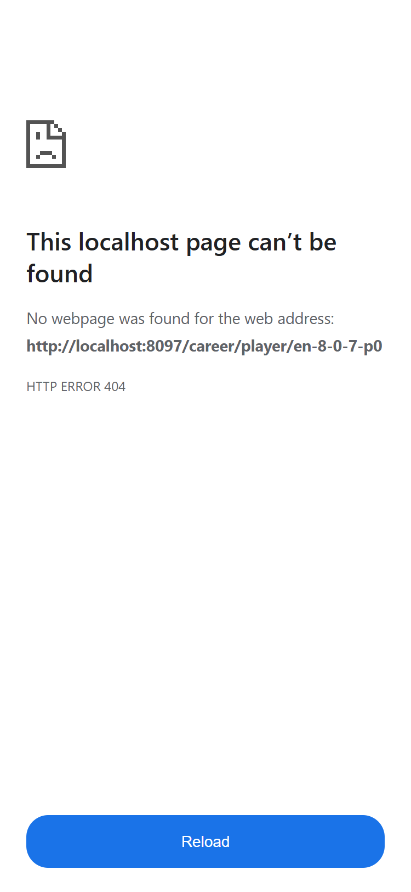

Tap a name for the **player's page**:

- **Eight skills, 1 to 99**: goalkeeping (GKP), defending (DEF), passing (PAS), technique (TEC),
  finishing (FIN), aerial (AIR), pace (PAC) and endurance (END). The overall rating (OVR) weighs
  the skills that matter for his position.
- **Condition** drops with every match (less with endurance) and comes back with rest. A tired
  player plays below himself and is more often hurt.
- **Spirit** follows his playing time against what his contract promised, results, the armband and
  a contract about to end. A player whose spirit stays low for weeks asks to leave.
- **His season and his career**, goals, assists and marks.
- **His contract**: offer a new one, put him on the transfer list or up for loan, or release him.

## 6. Tactics

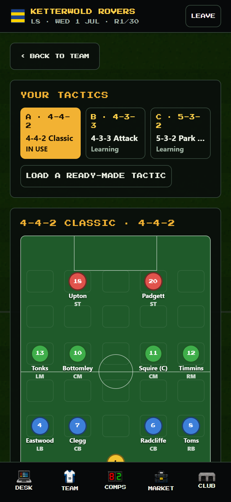

Team, **Tactics**: three tactics, **A**, **B** and **C**; choose the one the team starts with (**Use
tactic A**). **Load a ready-made tactic** gives a start: 4-4-2 Classic, 4-3-3 Attack, 4-5-1 Counter,
5-3-2 Park the Bus, 3-5-2 Wing Play, 4-4-2 Long Ball or 4-2-3-1 Possession.

- **The shape.** Drag a player to another cell of the pitch, or tap him and then a cell. Where he
  stands sets his role: a midfielder pulled back holds (DM), pushed up he attacks (AM); a full back
  pushed up becomes a wing back; a forward out wide is a winger.
- **Five instructions**: mentality (defensive, balanced, attacking), passing (short, mixed, long),
  pressing (low, medium, high), the defensive line (deep, normal, high) and width (narrow, normal,
  wide). The page says in plain words when your players do not suit them, and **How it plays**
  shows the tactic in four bars.
- **Styles meet.** A high press troubles a short-passing side but long balls go over it; fast
  forwards punish a high line; a deep, direct side catches out a team that comes forward.
- **Familiarity.** A tactic gets stronger with every match played with it; each change of an
  instruction or a player's place costs a little of it.
- **The game plan.** For winning by 2+, winning by 1, drawing, losing by 1 and losing by 2+, choose
  to keep going, tighten up, go for it, or switch to another of your tactics, from the minute you
  pick. With the plan on in the match, it also changes tired players from the hour.

> **Tip.** Pick one tactic that suits your best players and stick with it: familiarity is worth a
> lot. Keep B for chasing a game and C for holding a lead, and let the game plan switch to them.

## 7. Training, youth and the medical room

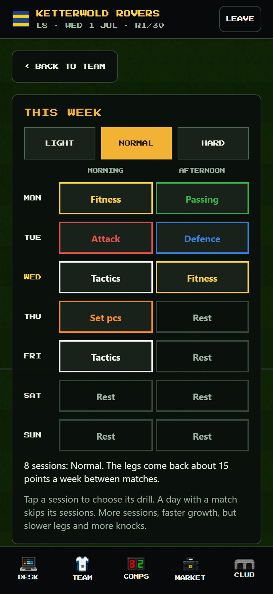

Team, **Training**: the week's timetable, a morning and an afternoon session each day. Tap a session
to choose its drill: fitness, attack, defence, passing, tactics, set pieces or rest. **Light**,
**Normal** and **Hard** fill the week for you.

- Players improve (and the old slow their decline) **day by day** through training, not all at once
  in the summer.
- Hard weeks build more but tire legs and bring knocks in training; rest brings condition back.
- **One to one**: up to three players can work on a skill of their own, learn a new position, or
  rest.
- Every Monday a letter says who grew, who slipped and who took a knock; with an assistant on the
  staff, he adds his word.

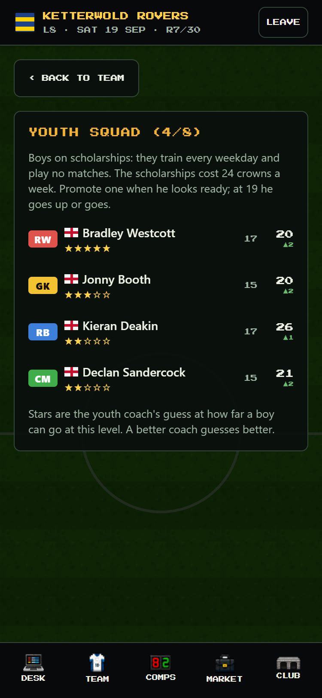

**Youth**: the boys in your youth team. A new **intake** arrives every March: **See the intake**,
sign the boys you want (or **Sign the coach's pick**); those not signed by the end of June leave.
**Promote** a boy to the first team when he is ready; at 19 a letter asks you to decide. Room in the
youth team grows with the training ground.

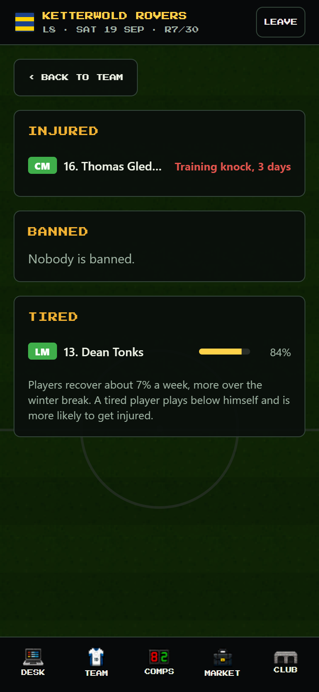

**Medical**: who is injured and for how long, who is banned, who is tired, and who is one yellow card
from a ban. Every fifth yellow card is a one-match ban; a red card is two (a second yellow, one).
Friendlies bring no bans.

> **Tip.** Rotate in a busy week. A player under about 85% condition plays below himself; rest him
> in the reserves and he is fresh for the next match.

## 8. The league, the cups and the summer

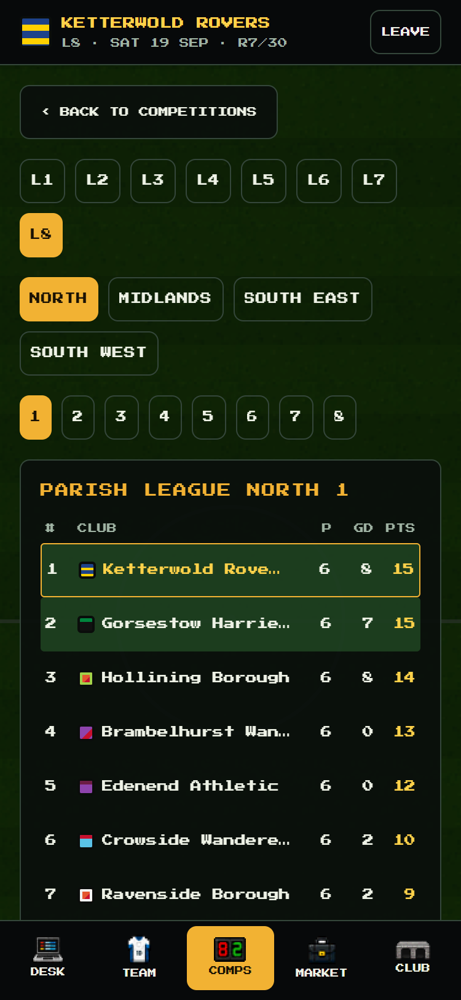

Comps, **League**: the table of any group of any of the eight levels, your own first. A win is worth 3
points, a draw 1; clubs level on points are split by goal difference, then goals scored. **Green**
rows go up at the end of the season, **red** rows go down.

| Level | Groups | Clubs | Rounds |
| --- | --- | --- | --- |
| 1 to 3 | one national league each | 18 | 34 |
| 4 | north and south | 16 | 30 |
| 5 | one per region | 16 | 30 |
| 6, 7, 8 | local groups in every region | 16 | 30 |

League matches are on Saturdays from mid-August to May, with a winter break after the nineteenth
round.

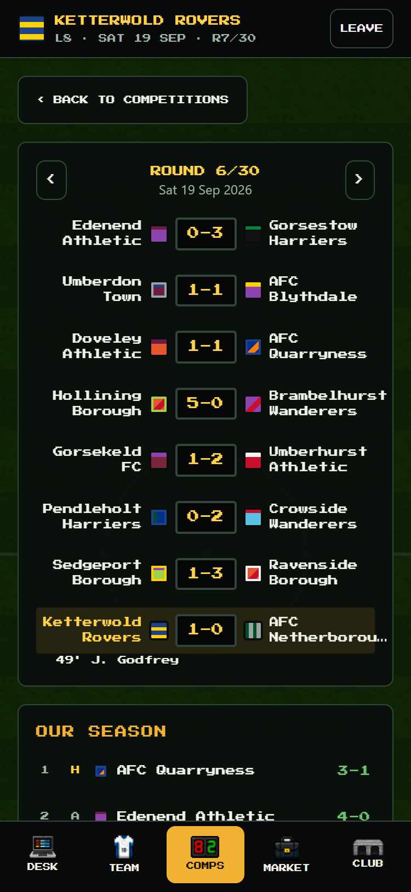

**Fixtures**: every match of a round, and your own season. **Stats**: the top scorers and assists of
every division, the player and the manager of the month, the awards. **Seasons**: your record,
season by season.

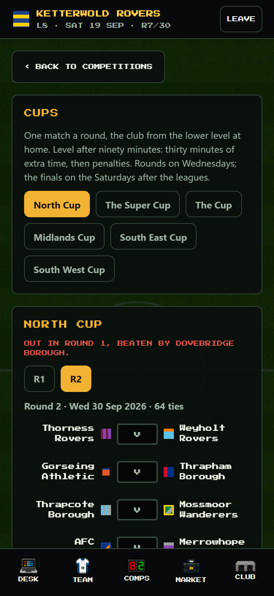

**Cups** are played midweek. Clubs at levels 5 to 8 play their region's cup; levels 1 to 4, and the
regional cups' winners, play the national cup. A tie is one match at the lower club's ground; a
draw goes to extra time and penalties. The best clubs of the top level play in the **Continental**
League and the Continental Cup.

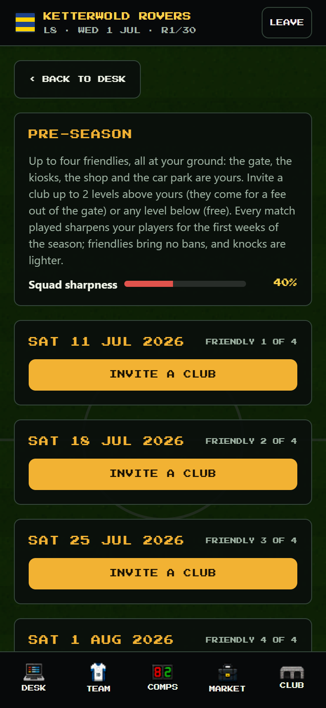

**Pre-season**: in July you can book up to four home friendlies on Saturdays. They build sharpness
(the team starts the summer at 40%) and the tactic's familiarity. Clubs below you come for free;
clubs up to two levels above ask an appearance fee, and draw a bigger crowd.

> **Tip.** Book all four friendlies. A sharp team starts the season well, and the first matches
> count as much as the last.

## 9. The market

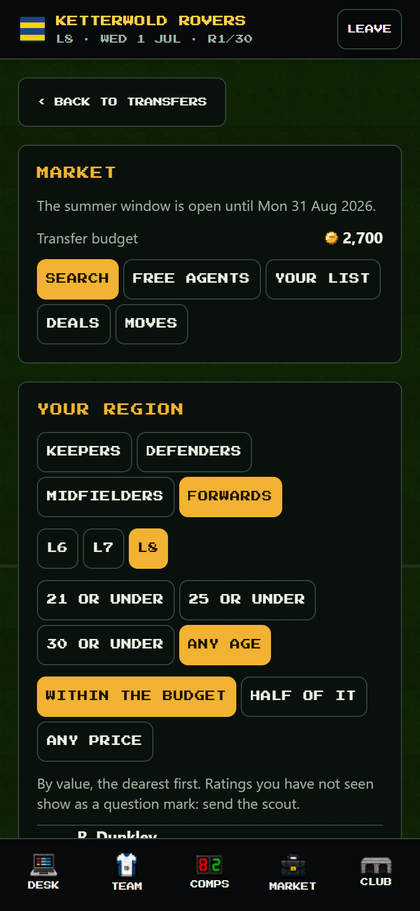

Market, **Market**: the transfer windows are open in **July and August** and in **January**, and you
can make **three signings a window**. Free agents (players without a club) can be signed at any time.

- **Search** by position, level, age and price ("Within the budget", "Half of it", "Any price").
  **Free agents**, **Your list** (players you follow), **Deals** in progress and the season's
  **Moves**.
- **The transfer budget** is set by the owner from the bank balance. It is not the balance: you
  can have money in the bank and nothing to spend. Half of any fee you receive goes back into it.
- **Buying**: open a player, make a bid (the keys add or take off 5% and 10%), **Buy him** or **Loan
  until the summer**. The club may counter once. Then agree his terms (**What he asks**, **Offer
  the terms**), or **Walk away**.
- Some players will not drop levels, and a regular at a much bigger club will not see your club as a
  step up; the deal page says so before any fee is paid.
- **Selling**: on a player's page, **Put him on the transfer list** or **Up for loan**. Offers come
  as letters.

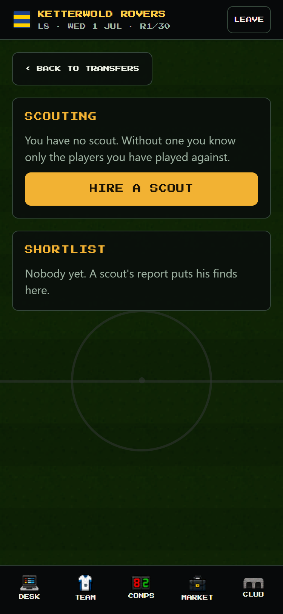

**Scouting**: a player you have not scouted shows only an estimate of his ratings. Hire a scout (he
needs no staff place), then send him to watch a club, to search for players, or to look at one
player; he writes back with a report and adds the best to your **shortlist**. A trip abroad takes
longer.

> **Tip.** At the bottom, free agents are your best market: no fee, only a wage. Scout before you
> buy; an estimate can flatter.

## 10. Contracts

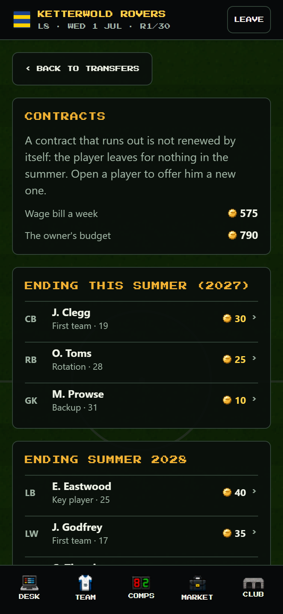

Market, **Contracts**: every player's wage and contract, the ones ending this season first.

- **A contract that runs out is not renewed for you.** The player leaves for nothing in the summer.
  From January the players whose contracts end write to you.
- **Offer a new contract** from the player's page: a **status** (key player, first team, rotation or
  backup), a length in years, a **wage** within the owner's wage budget, and a **bonus** (none,
  modest or generous) paid for each goal, or each clean sheet for a goalkeeper. A bonus lowers the
  wage he asks.
- **The status is a promise of playing time.** A key player who sits on the bench loses spirit.
- A player who says no will not talk again until after the next match. Players over 32 sign for one
  or two years at most.
- **Release him** pays off the rest of his contract.
- **A player who wants to leave** writes when his spirit has been low for weeks. Put him on the
  list, **promise him games** (four in eight weeks: keep the promise and he settles, break it and
  it is worse), or keep him (he may ask again; the third time, he will not sign again).

## 11. The money

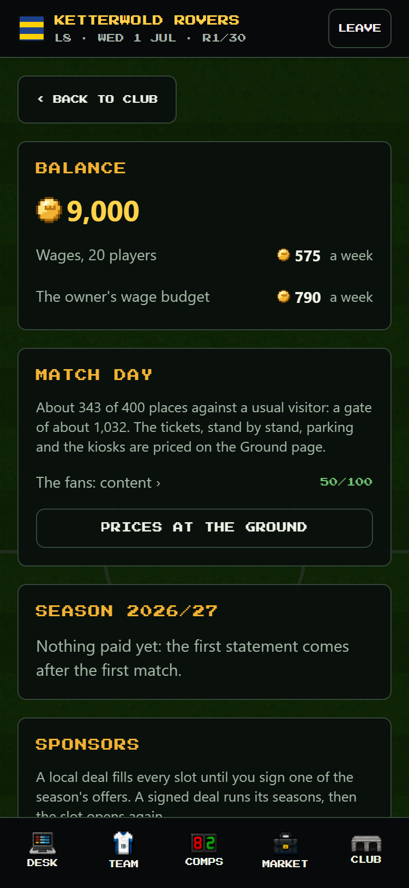

Club, **Finances**: where the money comes from and where it goes, week by week and season by season.

- **In**: the gate, season tickets (from level 5), TV, **sponsors**, prize money, the owner's bonus,
  player sales, catering, parking and the shop.
- **Out**: wages, staff, upkeep, travel, building and interest.
- **A statement** arrives each Monday after a league weekend.
- **Sponsors**: the shirt, the kit and the boards (and the ground's name from level 4). Their
  offers stand all season, but **a deal pays only from the week it is signed**.
- **The bank**: an overdraft up to eight weeks' wages, and one loan over one to three seasons. The
  bank lends nothing to a club already in the red.
- **The shop** (Club, Shop) sells shirts and scarves; order stock, and launch a new kit in the
  summer.

> **Tip.** Sign every sponsor before your first match: each week unsigned is money lost. And stay
> out of the red: an owner who bails the club out once will not do it twice.

## 12. The ground

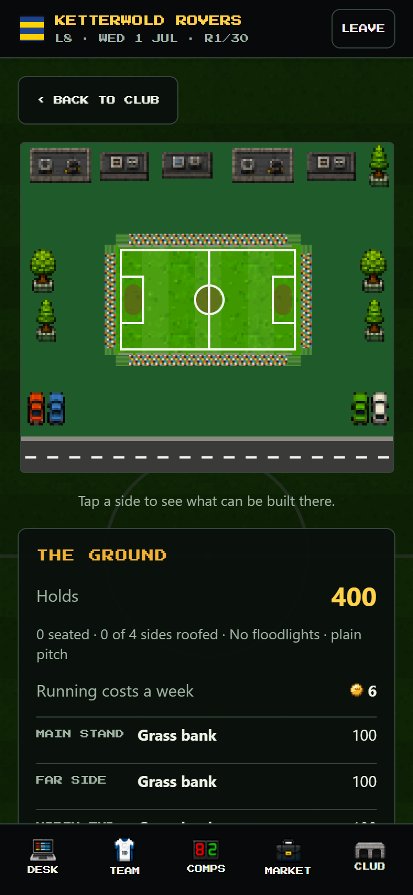

Club, **Ground**: your ground from above. Build its sides in stages (terraces, then seats), add roofs,
floodlights, a better pitch, toilets, first aid, and buildings such as the training ground. A third
of a building's cost is paid when it starts, the rest week by week.

**Every level has rules for the ground**:

| Level | The ground needs |
| --- | --- |
| 8 | 300 places |
| 7 | 800 places |
| 6 | 1,500 places, a roof, toilets |
| 5 | 3,000 places, 250 seats, floodlights, first aid |
| 4 | 5,000 places, 1,000 seats, two roofs |
| 3 | 10,000 places, 5,000 seats, three roofs, a good pitch |
| 2 | 18,000, all seated |
| 1 | 25,000, all seated |

A promoted club whose ground falls short gets **one season** to build what is missing; if it still
falls short at that season's end, the club goes back down. From the winter break the Desk warns a
club near the top what the level above asks, what it costs and what is in the bank.

> **Tip.** Build a season ahead of the climb. A bigger training ground also gives room for more
> coaches and more boys in the youth team.

## 13. The owner, the fans and your job

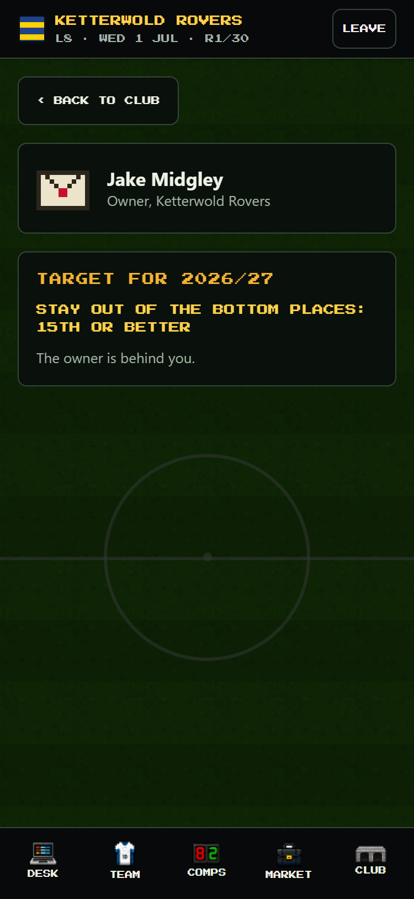

Club, **Owner**: this season's target and how past seasons measured up. The owner sets the target
from how your squad compares with the rest of your group: **promotion**, **the top half**, or
**staying out of the bottom places**.

- Miss the target and a **warning letter** follows (not in your first season: the owner gives you
  time to settle). Two targets met in a row tear one up.
- Too many warnings bring an **ultimatum**: points from the next ten league matches. Fail it and you
  are sacked.
- Money counts too: a club deep in the red for weeks gets an ultimatum of its own.

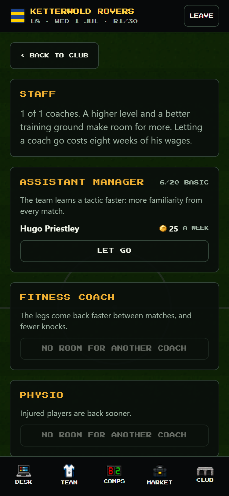

**Staff**: coaches for your assistant, fitness, injuries (the physio), goalkeepers and youth, and a
scout. Your level and the training ground decide how many coaches you can have; three candidates
come each month.

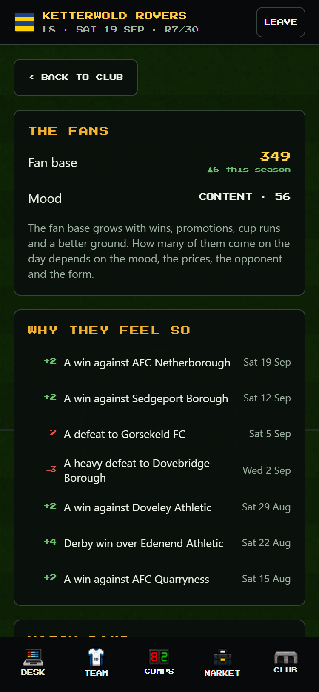

**Fans**: how many follow the club and their mood, from delighted to furious, and why. Winning, a
good season and fair prices fill the ground; a happy crowd is worth a little on the pitch too.

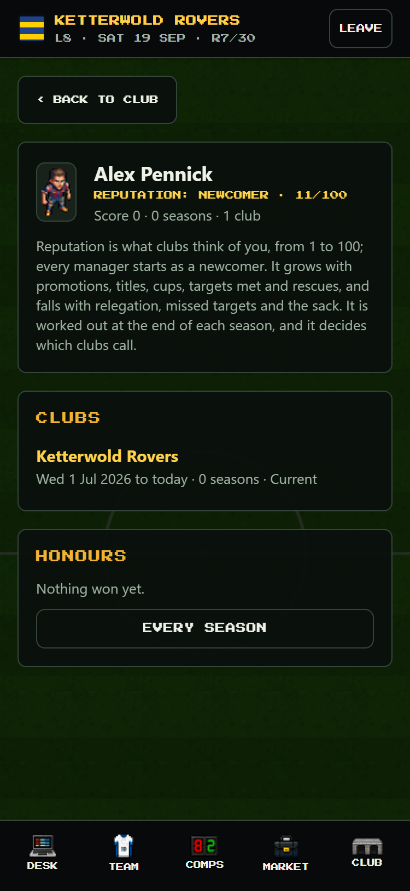

**Manager**: your reputation and your record. Reputation grows with results; with it, **other
clubs write** to offer you their job, in early July after a good season or in January if you are
high in the table. Taking it moves you there; saying no changes nothing. A sacked manager can take
a job that comes, or retire.

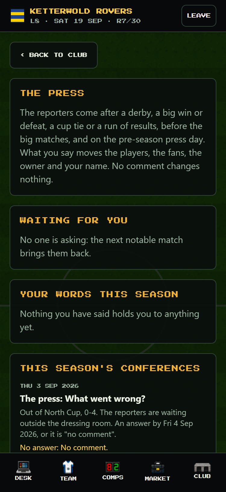

**Press**: a reporter's question after big matches, before important ones and in pre-season. Your
answer moves the players, the fans or the owner; **No comment** changes nothing.

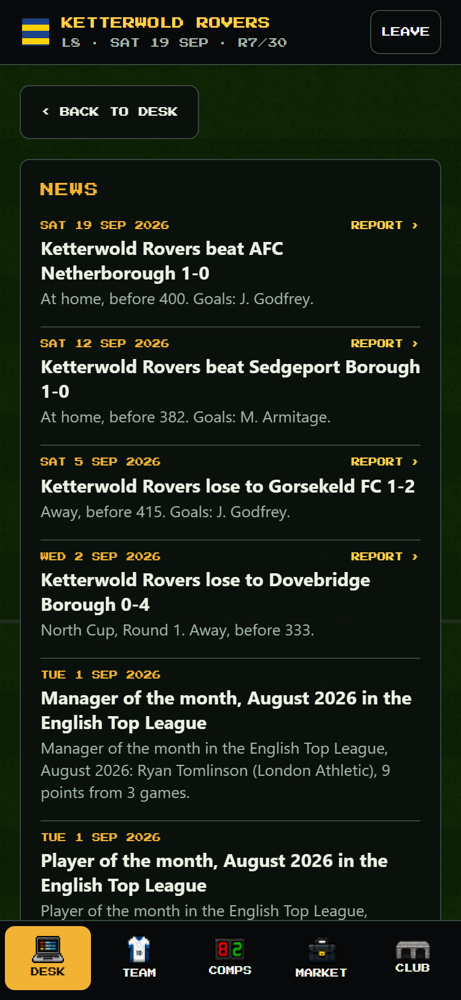

**News**: the season so far, match by match, and the summer's comings and goings.

## 14. The end of a season

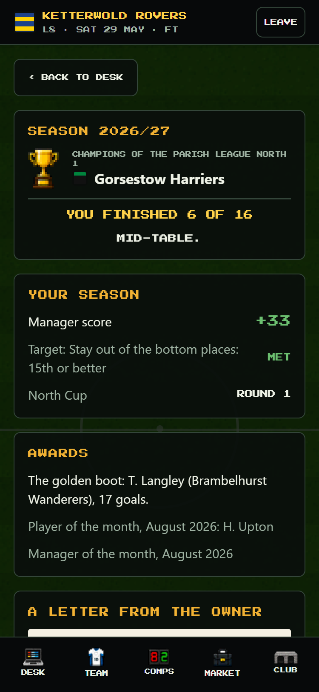

When your league is done the Desk shows the final table; the levels above play on until May (**Skip
to season end** if you do not want to wait). The **season review** shows your finish, the owner's
letter, the champions of every level and the awards; then **Start** the next season.

Over the summer:

- The top of each group goes up and the bottom goes down.
- Every player gets a year older. From 33, some retire.
- Contracts that run out end, and those players leave.
- The first team is topped up from the youth team.
- Injuries heal, yellow cards are wiped (bans stay).
- The owner sets a new target, and the transfer window opens on 1 July.

## 15. Signing in and playing on more than one device

You never need an account to play. **Signing in** on the title screen (with Google, Microsoft or
GitHub) keeps a copy of your careers in your account, up to three, so you can start on your phone
and carry on in the browser on your laptop. The game still works without a connection: a career
played offline goes to your account when the device is back online. If you played on two devices
without a connection, the game shows both and asks which to keep.

Mudcrown is a game for one: no leaderboard, no matches or transfers between players.

## 16. Tips and tricks

**The first week**

- Before pressing Continue: sign every **sponsor** (Finances), book four **friendlies**
  (Pre-season), press **Pick best XI** (Squad), and load a ready-made **tactic** that suits your best
  players.
- Look at **Contracts** and the **owner's target** so nothing surprises you in May.

**Winning matches**

- Read the **opponent report** on the Desk before each match: it tells you how they play and how to
  beat them.
- **Familiarity** beats cleverness. Change your main tactic little and seldom.
- **Fresh legs**: rotate tired players, and keep one or two forwards on the bench for when you are
  chasing a game.
- Use the **game plan** if you play Instant: it makes the changes a manager would.
- Set **penalty and free kick takers** to your best finishers.

**Building the squad**

- **Free agents** cost no fee, and can be signed outside the windows.
- **Scout** before you buy; an unscouted player's ratings are only an estimate.
- **Renew** your good players early, before January; a player whose contract ends walks away for
  nothing.
- **Sign the intake's best boys** every March, and give the best of them games: young players grow
  fastest.
- Sell a player who wants to leave rather than keep him unhappy; half the fee goes into your budget.

**The club**

- **Never go into the red** if you can help it: the bank stops lending, and the owner loses
  patience.
- **Build ahead of promotion.** Check the next level's ground rules at the winter break.
- A **bigger training ground** means more coaches and more boys.

**Your job**

- In your first season the owner gives you time; from the second, the target counts.
- A missed target is not the end: meet the next two and a warning is torn up.

---

Something unclear or wrong here? [Open an issue](https://github.com/bc4all/Mudcrown/issues/new/choose).
